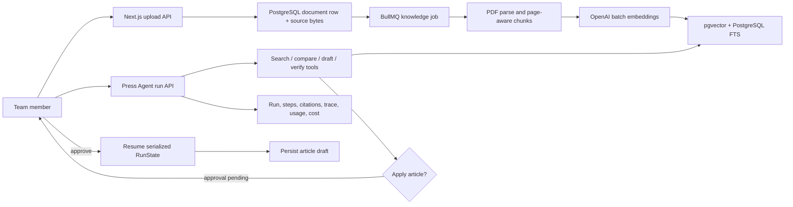

# PressTuner grounded document Agent

## Outcome

PressTuner now extends its existing Press workflow with a team-scoped knowledge
base and one server-owned document Agent. A user uploads a PDF, the scheduler
parses and indexes it, hybrid retrieval returns page-level citations, and the
Agent can search, compare, draft, verify, and—only after explicit approval—apply
a press-release draft.

This is intentionally one Agent with explicit tools. PostgreSQL is the product
source of truth; OpenAI Agents SDK state and traces supplement, rather than
replace, durable run records.

## Data and execution flow

## Storage model

- `KnowledgeDocument` stores team ownership, immutable source bytes, active
  generation, optional role override, status, retry count, and failure details.
- `KnowledgeIndexGeneration` stores each immutable parse/embed/classification
  attempt and its versioned fingerprint. Activation is atomic; a failed
  generation never replaces the last searchable generation.
- `KnowledgeChunk` belongs to one generation and stores a stable ordinal, page
  range, automatic role/confidence/rationale, text, PostgreSQL search vector,
  and 1,536-dimensional embedding. The migration enables `vector`,
  creates an HNSW cosine index, and creates a GIN full-text index.
- `ArticleEvidenceCandidate`, `ArticleFact`, and `ArticleDraftEvidence` separate
  discovery, explicit acceptance, and evidence actually used by a canonical
  draft hash. Editing a RAG fact detaches all source provenance.
- `ArticleVerification` and its findings snapshot draft hash, grounding
  revision, and team corpus version. `ArticleFinalCitation` records only
  evidence supporting the verified final draft.
- `AgentRun` stores prompt/output, serialized SDK state, lifecycle, trace ID,
  model, cumulative actual token usage, estimated micro-USD cost, latency,
  retries, and errors.
- `AgentStep` stores ordered model/tool activity, bounded input/output summaries,
  actual incremental usage, cost, latency, retry generation, and errors.
- `AgentRetrievedSource` stores search candidates. `AgentApproval` and the
  final-only `AgentCitation` make decisions and selected evidence independently
  auditable.

All document queries require `teamId`. Article application additionally checks
that the target article belongs to the same team.

## Indexing and retrieval choices

- Input is limited to PDF and 20 MB in v1. Source bytes are kept durably so a
  failed or version-changed index can be retried without another upload.
- Chunks preserve page provenance and stable ordinals inside an immutable
  generation. Re-indexing creates a new generation and never deletes historical
  chunks, so old citations remain resolvable.
- Retrieval uses the active generation and effective role
  (`document override` or automatic classification). Unclassified chunks fail
  closed. Existing READY generations can be classified without parsing or
  embedding again.
- The scheduler batches embeddings once at index time. Query execution embeds
  only the query; it does not re-embed the corpus.
- Retrieval combines pgvector cosine similarity and PostgreSQL full-text rank,
  applies team/document/status filters before ranking, and returns document,
  chunk, page, score, and source ID for citation rendering.

## Agent tools and policy

| Tool | Purpose | Selection rule |
| --- | --- | --- |
| `search_knowledge` | Retrieve team evidence | Required before factual writing |
| `compare_sources` | Compare dates, numbers, names, and conflicts | Use for multi-document or conflicting evidence |
| `draft_press_release` | Persist a cited proposal | Requires accepted article facts and computes the canonical draft hash |
| `verify_claims` | Validate exact draft and final source IDs | Required before presenting a grounded result |
| `apply_press_release` | Save the verified article draft | Requires the exact verified hash and explicit human approval |

The SDK `RunState` is serialized into the run checkpoint at interruption or
failure. Approval restores that state and resumes it. A failed run with an SDK
checkpoint can retry from the failed execution generation, while step retry
counts and idempotency keys preserve evidence of the attempt.

## Failure and observability behavior

- Upload, parsing, embedding, and indexing failures move the document to
  `FAILED` with a bounded code/message. Retry reuses the document and source.
- Tool calls write a `RUNNING` step before side effects, then record completion
  or normalized failure with latency and bounded summaries.
- Each SDK execution segment aggregates actual input, cached-input, and output
  tokens onto the durable run. Run cost uses configurable per-million-token
  rates and is stored in micro-USD.
- Scheduler enqueue records `queuedAt`; the worker records
  `processingStartedAt`. `npm run report:press-agent -- --hours 24` reports
  index success, queue/index P50/P95, run/tool P50/P95, failure rate, average
  retry count, approval wait, cached-input ratio, and average cost per run.
- The initial SDK trace ID is stored on the run; sensitive trace payload capture
  is disabled. Product state remains queryable even when trace export is
  unavailable.
- Approval rejection is durable and resumes the Agent with the rejected tool
  decision rather than silently applying the mutation.

## Evaluation

The version-aware harness validates the selected dataset and controlled corpus
through the same Zod-backed domain boundary before it scores an artifact.
`evals/press-rag/v1/cases.json` contains 30 cases covering single facts, numeric
facts, comparisons, conflicts, synthesis, and unanswerable questions. Its
matching `corpus.json` contains 15 logical documents. Run
`npm run eval:press-rag -- --results <results.json> --output <report.json>` to
calculate:

- retrieval Recall@5
- citation precision based on final `output.sourceIds`, not every retrieval candidate
- grounded claim rate
- unanswerable accuracy
- conflict-detection accuracy
- P50/P95 latency and total measured cost

Citation and grounded-claim rates also expose their numerator and denominator;
a zero observation denominator produces `null`. The first actual 30-case run is retained as
`results-2026-07-23.json` plus `baseline-2026-07-23.json`. The current measured
baseline is Recall@5 `0.92`, citation precision `0.3974`, grounded-claim rate
`0.4878`, unanswerable accuracy `0.7667`, conflict-detection accuracy `0.7333`,
P50/P95 run latency `4717/7702.1 ms`, and total measured Agent cost `36079`
micros for 30 runs. This is a controlled-corpus baseline, not a production-
traffic claim; citation selection and groundedness remain explicit tuning
priorities. Model, prompt, chunking, and ranking experiments must retain the
dataset/corpus version and a new measured report; they must not overwrite
historical baselines silently.

`evals/press-rag/v2` adds 30 offline domain-contract cases without changing the
v1 corpus or baseline. A measured v2 artifact adds coverage-aware summaries for
role isolation, exact candidate acceptance, excluded-source avoidance, exact
final-document selection, retrieved FACT-only final evidence, and
PASS/WARN/BLOCK accuracy. Omitted optional observations reduce coverage; an
explicit empty array remains a measured outcome. Validate it with
`npm run eval:press-rag -- --dataset evals/press-rag/v2/cases.json`; pass the
matching `--results` to score it. The retained v1 artifact is fixture-tested
against every historical metric value, while reports now preserve selected
dataset/corpus versions and supplied experiment identity fields.

This remains a controlled logical-ID benchmark. Artifact metadata is
self-reported, and the harness does not measure production traffic, judge
reliability, retrieval tuning, or live Agent quality. Passing it does not by
itself establish an Agent-quality improvement. See `evals/press-rag/README.md`
for the complete artifact and coverage contract.

## Controlled improvement lifecycle

The checked-in `agent-improvement-cycle/v1` artifact demonstrates a six-stage
producer lifecycle without changing runtime behavior:

1. `observe` retains the historical controlled-evaluation provenance.
2. `triage` derives case- and metric-specific failure signals.
3. `promote` groups those signals into traceable regression candidates.
4. `experiment` compares the historical baseline with a controlled replay.
5. `gate` evaluates quality, output retention, and independent cost evidence.
6. `human_review` records a pending or explicit human decision as metadata.

Run `npm run generate:press-rag-improvement` to reproduce
`evals/press-rag/improvement/controlled-replay-v1.json`. The original measured
observation keeps its `2026-07-23T09:21:12.369Z` collection timestamp. The
lifecycle timestamps come from a separate fixed replay epoch so deterministic
generation cannot be mistaken for a new measurement.

The replay removes only unsupported citations and ungrounded claims from cloned
historical observations; it reruns neither retrieval nor generation. Perfect
post-filter ratios therefore appear alongside the lost-output counts and
retention ratios. Both retention checks fail the explicitly non-production
demo thresholds, while candidate cost is `NOT_EVALUABLE` because the historical
cost is merely reused. Automated disposition remains `REVIEW_REQUIRED`, human
review remains `PENDING`, and deployment authorization remains false. Even an
approved review record is metadata only; this slice has no deployment action.

A future live producer must replace replay-derived observations with separately
executed baseline/candidate configurations, independently measure operational
latency and cost, validate judge reliability and production relevance, and
calibrate a new gate-policy version. It should preserve the exact contract
version boundary and provenance fields rather than relabel this controlled
artifact as live or post-deployment evidence.

## Article verification and FINAL

Generation reads accepted active facts from PostgreSQL and records the subset
reported as used. STYLE_POLICY is prescriptive; STYLE_EXAMPLE is a separate,
explicitly non-factual block. Review suggestions may cite only accepted facts,
and newly discovered material returns as a candidate for user approval.

Verification persists a snapshot of the canonical article hash, grounding
revision, and team corpus version. A changed draft, fact decision, or searchable
corpus makes the result stale. RAG-backed contradictions involving numbers,
periods, dates, people, titles, or direct quotes BLOCK; unsupported user facts
and style-policy violations WARN. Every transition to `ArticleStatus.FINAL`
uses the same finalization service and requires a current PASS or WARN.

## Deployment checklist

1. Ensure the production PostgreSQL service permits `CREATE EXTENSION vector`.
2. Apply migrations `20260723055000_add_knowledge_documents_pgvector`,
   `20260723061500_add_press_agent_runs`, and
   `20260723073000_add_knowledge_index_observability`.
3. Deploy the synchronized `PressTuner-scheduler`, Redis/BullMQ worker, and main
   app together.
4. Set `OPENAI_API_KEY`. Optionally set `PT_PRESS_AGENT_MODEL` and the three
   `PT_PRESS_AGENT_*_USD_PER_MILLION` rates when the selected model pricing
   differs from the checked-in `gpt-4.1-mini` defaults.
5. Upload the controlled evaluation corpus, collect 30 real outcomes, run the
   evaluation script, and retain the generated report as the first baseline.
6. Apply `20260803090000_agent_improvement_platform`, regenerate the sibling
   scheduler Prisma client from the synchronized schema, and configure the
   scoped Ops evidence export only when the protected dashboard is connected.

The migration was schema-validated and both applications were built locally; it
was not applied to a production database by this change.

## Knowledge lifecycle, limits, and feedback

- Uploads validate the actual buffer length and `%PDF-` magic bytes before a
  transaction. Team quota decisions are serialized with a PostgreSQL advisory
  transaction lock.
- Defaults are 20 MiB per PDF, 25 logical documents, 250 MiB of retained source
  bytes, and 10 accepted unique uploads per 3600 seconds. Override them with
  `KNOWLEDGE_MAX_FILE_BYTES`, `KNOWLEDGE_MAX_DOCUMENTS_PER_TEAM`,
  `KNOWLEDGE_MAX_STORED_BYTES_PER_TEAM`, `KNOWLEDGE_UPLOAD_RATE_LIMIT`, and
  `KNOWLEDGE_UPLOAD_RATE_WINDOW_SECONDS`; invalid values fail configuration.
- Deleting an uncited document purges its row, chunks, and bytes. Deleting a
  cited document archives it: it leaves listing/retrieval, but its PDF remains
  available to historical same-team citations and still consumes storage.
- Replacement creates a successor. The READY predecessor remains searchable
  until the successor is READY. A failed replacement therefore leaves the old
  source effective and retryable.
- Source PDFs are served only through the authenticated team-scoped source
  route with inline, no-store, nosniff, and sandbox headers. Citation links use
  `#page=N`. HTTP Range responses are intentionally not implemented because
  source files are capped at 20 MiB.
- Completed Agent runs accept per-user usefulness and citation-accuracy
  feedback. Each dimension can be changed independently; clearing both removes
  the row. Negative ratings also create a team-scoped regression-candidate
  signal in the same transaction. The candidate stores only a bounded,
  redacted excerpt and logical source IDs; prohibited data makes it ineligible.
  Positive ratings do not create cases, and no rating can promote a dataset or
  production configuration without the separate human-review workflow.

Apply `20260723170000_productize_press_rag_feedback_loop` before deploying code
that uses lifecycle, upload-ledger, or feedback fields. Then run the scheduler
`npm run generate` command to synchronize its generated Prisma schema mirror;
queue and worker behavior do not change.

## Primary implementation locations

- Knowledge API/UI: `app/api/knowledge`, `app/(dashboard)/team/knowledge`
- Indexing worker: sibling repository `PressTuner-scheduler/src/workers/knowledgeHandler.ts`
- Retrieval service: `lib/services/knowledge/knowledgeRetrievalService.ts`
- Agent runtime: `lib/services/press-agent/pressAgentRuntime.ts`
- Evaluation: `domain/evaluation`, `evals/press-rag`, and
  `scripts/evaluatePressRag.ts`

## Experiment, runtime, and promotion boundaries

`agent-experiment/v2` pins dataset, environment, configuration, execution, and
artifact hashes. A configuration identity covers model, prompt, embedding,
chunking, retrieval, reranking, toolset, runtime policy, and evaluator versions.
The deterministic executor is the only public/default executor. Live execution
requires an explicit live selection, operator authorization, model-spend
acknowledgement, and a configuration-aware injected runner. No default live
runner is registered because the current runtime cannot honestly reconstruct a
historical retrieval stack from version labels alone; unsupported live requests
fail closed.

`agent-experiment-cycle/v2` wraps the two executions with mandatory gate
results, human-review state, feedback provenance, audit events, and an
always-false deployment authorization flag. The checked 30-case deterministic
cycle has 15 passing synthetic checks but remains `NOT_EVALUABLE` while human
review is `PENDING`. Its cycle and experiment hashes are independently
verified; no live evidence is claimed by the checked fixtures.

Every observation is labeled `measured`, `synthetic`, `replay_derived`,
`judge_derived`, or `missing`. Missing latency, tokens, cost, judge, human, and
domain values remain null and `NOT_EVALUABLE`; they are never replaced by zero.
Mandatory gates cover retrieval, citations, groundedness, answerability,
conflicts, tools, task success, retention, independently measured cost/latency,
recovery, terminal verification, and adversarial behavior. Human approval can
authorize an immutable configuration record only. It never authorizes deployment.

Feedback candidates are team-scoped, consent/eligibility checked, bounded,
redacted, deduplicated by content, and retain every logical provenance edge.
Negative usefulness and citation-accuracy ratings are wired directly into this
queue, making the runtime-feedback-to-review boundary executable rather than a
standalone helper. Authenticated team administrators can submit the other
strict signal kinds—approval rejection, runtime failure, draft edit,
verification finding, and retry trace—through the regression-candidate route;
the server still recalculates redaction and eligibility before storing them.
Promotion requires human review and creates a new dataset version rather than
mutating its parent. Runtime audit events omit prompts, secrets, checkpoint
contents, and full source excerpts. The runtime enforces cancellation, deadlines,
token/cost budgets, per-tool timeouts, approval-gated writes, mutation
idempotency, and completion verification.

The additive `20260803090000_agent_improvement_platform` migration must be
applied before these persistence paths are enabled. Before a PressTuner release,
run `npm run generate` and `npm run build` in `PressTuner-scheduler` so its schema
mirror is reviewed. Roll application code back first; retain provenance tables
until a separate archival migration is approved.

For the protected Ops Console connection, configure
`PT_AGENT_EVIDENCE_EXPORT_TOKEN` and one scoped
`PT_AGENT_EVIDENCE_EXPORT_TEAM_ID`. The authenticated experiment GET route then
exports strict producer envelopes. The credential is server-only and must never
use a `NEXT_PUBLIC_*` name.
